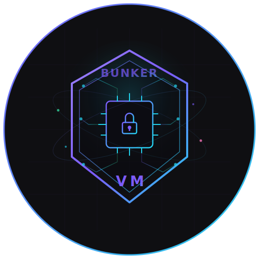

<p align="center">
  
</p>

<h1 align="center">BunkerVM</h1>

<p align="center">
  <code>pip install</code> a VM for your AI agent.
</p>

<p align="center">
  <a href="https://pypi.org/project/bunkervm/"></a>
  <a href="https://github.com/ashishgituser/bunkervm"></a>
  
  
  
  <a href="https://github.com/ashishgituser/bunkervm/blob/main/LICENSE"></a>
</p>

<p align="center">
  Your AI agent can run <code>rm -rf /</code>. Let it — <strong>inside a bunker.</strong>
</p>

<p align="center">
  
</p>

---

**The problem:** AI agents generate and execute code on _your_ machine. One bad LLM output and your files, credentials, or entire system could be gone. Docker shares the kernel — [container escapes are real](https://cve.mitre.org/cgi-bin/cvekey.cgi?keyword=docker+escape). You need **hardware isolation**.

**The fix:** BunkerVM boots a Firecracker microVM in **~3 seconds**, runs the code inside a throwaway Linux sandbox with its own kernel, and destroys everything after. One `pip install`. Zero config. Works with LangChain, OpenAI Agents SDK, CrewAI, and MCP out of the box.

---

## Quick Start

```bash
pip install bunkervm
```

```python
from bunkervm import run_code

result = run_code("print('Hello from a microVM!')")
print(result)  # Hello from a microVM!
```

One function. VM boots (~3s), code runs, VM dies. **Your host was never touched.**

<details>
<summary><strong>See <code>bunkervm demo</code> output</strong></summary>

```
  ╔══════════════════════════════════════╗
  ║         BunkerVM Demo                ║
  ║  Hardware-isolated AI sandbox        ║
  ╚══════════════════════════════════════╝

Starting BunkerVM...
Launching Firecracker microVM...
Running code inside sandbox...

OS:       Linux-6.1.102-x86_64-with
Hostname: bunkervm
Python:   3.12.12

Prime numbers under 100:
2 3 5 7 11 13 17 19 23 29 31 37 41 43 47 53 59 61 67 71 73 79 83 89 97

✓ Code ran safely inside a Firecracker microVM
✓ Full Linux environment (not a container)
✓ Hardware-level isolation via KVM
✓ VM will be destroyed after this demo

Done. ✓ Demo completed in 3.6s
```

</details>

---

## Why Not Docker?

|  | BunkerVM | Docker |
|---|---|---|
| **Isolation** | Hardware (KVM) — **separate kernel** | Shared kernel |
| **Escape risk** | Near zero | [Container escapes exist](https://cve.mitre.org/cgi-bin/cvekey.cgi?keyword=docker+escape) |
| **Boot time** | ~3s | ~0.5s |
| **Setup** | `pip install bunkervm` | Dockerfile + build + run |

---

## Framework Integrations

Every integration auto-boots a Firecracker VM and exposes **6 sandboxed tools** — `run_command`, `write_file`, `read_file`, `list_directory`, `upload_file`, `download_file`.

All toolkits inherit from `BunkerVMToolsBase` — identical behaviour regardless of framework.

### LangChain / LangGraph

```bash
pip install bunkervm[langgraph] langchain-openai
```

```python
from langchain_openai import ChatOpenAI
from langchain.agents import create_agent
from bunkervm.langchain import BunkerVMToolkit

with BunkerVMToolkit() as toolkit:                  # boots VM (~3s)
    agent = create_agent(
        ChatOpenAI(model="gpt-4o"),
        tools=toolkit.get_tools(),                  # 6 sandbox tools
    )
    agent.invoke({"messages": [("user", "Find primes under 100")]})
# VM auto-destroyed
```

<details>
<summary>Agent execution output</summary>

```
⏳ Booting sandbox VM...  ✅ Sandbox ready

→ write_file: /tmp/primes.py (312 bytes)
→ run_command: python3 /tmp/primes.py  ← OK (42ms)

🤖 [2, 3, 5, 7, 11, 13, 17, 19, 23, 29, 31, 37, 41, 43, 47,
    53, 59, 61, 67, 71, 73, 79, 83, 89, 97]

🧹 Sandbox destroyed.
```

</details>

### OpenAI Agents SDK

```bash
pip install bunkervm[openai-agents]
```

```python
from agents import Agent, Runner
from bunkervm.openai_agents import BunkerVMTools

tools = BunkerVMTools()                              # boots VM (~3s)
agent = Agent(
    name="coder",
    instructions="You write and run code inside a secure VM.",
    tools=tools.get_tools(),                         # 6 sandbox tools
)
result = Runner.run_sync(agent, "First 20 Fibonacci numbers")
print(result.final_output)
tools.stop()
```

<details>
<summary>Agent execution output</summary>

```
⏳ Booting sandbox VM...  ✅ Sandbox ready

→ write_file: /tmp/fib.py (198 bytes)
→ run_command: python3 /tmp/fib.py  ← OK (38ms)

🤖 0, 1, 1, 2, 3, 5, 8, 13, 21, 34, 55, 89, 144, 233, 377,
   610, 987, 1597, 2584, 4181

🧹 Sandbox destroyed.
```

</details>

### CrewAI

```bash
pip install bunkervm[crewai]
```

```python
from crewai import Agent, Task, Crew
from bunkervm.crewai import BunkerVMCrewTools

tools = BunkerVMCrewTools()                          # boots VM (~3s)
coder = Agent(
    role="Software Engineer",
    goal="Write and test code inside a secure sandbox",
    tools=tools.get_tools(),                         # 6 sandbox tools
)
task = Task(description="Bubble sort a random list", agent=coder,
            expected_output="The sorted list")
Crew(agents=[coder], tasks=[task]).kickoff()
tools.stop()
```

<details>
<summary>Agent execution output</summary>

```
⏳ Booting sandbox VM...  ✅ Sandbox ready

🔧 write_file → /tmp/sort.py  ✅ 403 bytes
🔧 run_command → python3 /tmp/sort.py
   Original: [83, 11, 25, 19, 86, 52, 97, 5, 70, 69]
   Sorted:   [5, 11, 19, 25, 52, 69, 70, 83, 86, 97]

🧹 Sandbox destroyed.
```

</details>

### Install all integrations

```bash
pip install bunkervm[all]    # LangChain + OpenAI Agents SDK + CrewAI
```

> Full working examples: [`examples/`](examples/)

---

## VS Code + Copilot

> **Every line of code Copilot runs — hardware-isolated.** Two commands. No extensions to install.

### Setup (30 seconds)

```bash
pip install bunkervm
bunkervm vscode-setup
```

That's it. Reload VS Code (`Ctrl+Shift+P` → "Reload Window"). Copilot Chat now has 8 sandboxed tools.

> **Windows users:** These commands run in your normal PowerShell terminal.
> `vscode-setup` auto-detects Windows, creates an isolated Python environment inside WSL,
> installs BunkerVM there, and generates the correct config. You don't need to touch WSL directly.

### Enable internet inside the VM (optional)

```bash
bunkervm enable-network
```

On Windows this auto-proxies into WSL and prompts for your Linux password.
On Linux, prefix with `sudo`.

### How it works

1. `bunkervm vscode-setup` generates `.vscode/mcp.json` — auto-detects your OS
2. On Windows: creates `~/.bunkervm/venv` inside WSL, installs BunkerVM there automatically
3. VS Code starts BunkerVM as an MCP server (via WSL on Windows, directly on Linux)
4. A Firecracker microVM boots (~3s) with its own Linux kernel
5. Copilot Chat gets 8 tools: `sandbox_exec`, `sandbox_write_file`, `sandbox_read_file`, `sandbox_list_dir`, `sandbox_upload_file`, `sandbox_download_file`, `sandbox_status`, `sandbox_reset`
6. When Copilot writes code → it runs inside the VM → your host is never touched

### Try it

Open Copilot Chat and ask:

- *"Write a Python script that finds primes under 1000, save it, and run it in the sandbox"*
- *"Fetch the top 3 Hacker News posts in the sandbox"*
- *"Run `uname -a` in the sandbox to show me the VM's kernel"*

<details>
<summary>What <code>bunkervm vscode-setup</code> generates</summary>

Linux:
```json
{
  "servers": {
    "bunkervm": {
      "command": "/usr/local/bin/bunkervm",
      "args": ["server"]
    }
  }
}
```

Windows (auto-detected — installs in WSL venv automatically):
```json
{
  "servers": {
    "bunkervm": {
      "command": "wsl",
      "args": ["-d", "Ubuntu", "--", "/home/you/.bunkervm/venv/bin/bunkervm", "server"]
    }
  }
}
```

</details>

---

## More Features

<details>
<summary><strong>Reusable Sandbox</strong> — Keep the VM alive for multiple runs</summary>

```python
from bunkervm import Sandbox

with Sandbox() as sb:
    sb.run("x = 42")
    sb.run("y = x * 2")
    result = sb.run("print(f'{x} * 2 = {y}')")
    print(result)  # 42 * 2 = 84
```

State persists between `run()` calls — variables, imports, everything stays.

</details>

<details>
<summary><strong>Secure AI Agent</strong> — One-line agent sandboxing</summary>

```python
from bunkervm import secure_agent

runtime = secure_agent()
result = runtime.run("print('Sandboxed!')")
print(result)
runtime.stop()
```

</details>

<details>
<summary><strong>Claude Desktop (MCP)</strong></summary>

Add to `claude_desktop_config.json`:

```json
{
  "mcpServers": {
    "bunkervm": {
      "command": "python3",
      "args": ["-m", "bunkervm"]
    }
  }
}
```

Windows (WSL2):
```json
{
  "mcpServers": {
    "bunkervm": {
      "command": "wsl",
      "args": ["-d", "Ubuntu", "--", "python3", "-m", "bunkervm"]
    }
  }
}
```

</details>

<details>
<summary><strong>Multi-VM Support</strong> — Run multiple sandboxes simultaneously</summary>

```python
from bunkervm import VMPool

pool = VMPool(max_vms=5)
pool.start("agent-1", cpus=2, memory=1024)
pool.start("agent-2", cpus=1, memory=512)

pool.client("agent-1").exec("echo 'I am agent 1'")
pool.client("agent-2").exec("echo 'I am agent 2'")
pool.stop_all()
```

</details>

<details>
<summary><strong>Web Dashboard</strong></summary>

```bash
bunkervm server --transport sse --dashboard
# Dashboard at http://localhost:3001/dashboard
```

Real-time monitoring: VM status, CPU, memory, live audit log, and reset controls.

</details>

<details>
<summary><strong>MCP Tools</strong> — 8 tools exposed via MCP server</summary>

| Tool | Description |
|---|---|
| `sandbox_exec` | Run any shell command |
| `sandbox_write_file` | Create or edit files |
| `sandbox_read_file` | Read files |
| `sandbox_list_dir` | Browse directories |
| `sandbox_upload_file` | Upload files host → VM |
| `sandbox_download_file` | Download files VM → host |
| `sandbox_status` | Check VM health, CPU, RAM |
| `sandbox_reset` | Wipe sandbox, start fresh |

</details>

<details>
<summary><strong>CLI Reference</strong></summary>

```
bunkervm demo                        # See it in action
bunkervm run script.py               # Run a script in a sandbox
bunkervm run -c "print(42)"          # Run inline code
bunkervm server --transport sse      # Start MCP server
bunkervm info                        # Check system readiness
bunkervm vscode-setup                # Set up VS Code MCP integration
bunkervm enable-network              # One-time: enable VM networking (needs sudo)

Options:
  --cpus N          vCPUs (default: 1 for run, 2 for server)
  --memory MB       RAM in MB (default: 512 for run, 2048 for server)
  --no-network      Disable internet inside VM
  --timeout SECS    Execution timeout (default: 30)
  --dashboard       Enable web dashboard (server mode)
```

</details>

---

## How It Works

```
Your AI Agent
     │
     ▼
  bunkervm        ──vsock──▶   Firecracker MicroVM
  (host)                       ┌──────────────────┐
                               │  Alpine Linux     │
                               │  Python 3.12      │
                               │  Full toolchain   │
                               │  exec_agent       │
                               └──────────────────┘
                               Hardware isolation (KVM)
                               Destroyed after use
```

- **[Firecracker](https://firecracker-microvm.github.io/)** — Amazon's micro-VM engine (powers AWS Lambda)
- **vsock** — Zero-config host↔VM communication
- **~100MB bundle** — Firecracker + kernel + rootfs, auto-downloaded on first run

---

## Install

```bash
pip install bunkervm                  # Core
pip install bunkervm[langgraph]       # + LangGraph/LangChain
pip install bunkervm[openai-agents]   # + OpenAI Agents SDK
pip install bunkervm[crewai]          # + CrewAI
pip install bunkervm[all]             # Everything
```

**Requirements:** Linux with KVM, or Windows WSL2 with nested virtualization. Python 3.10+.

> Need `/dev/kvm` access? Run `bunkervm info` to diagnose, or `sudo usermod -aG kvm $USER` then re-login.

<details>
<summary><strong>WSL2 Setup (Windows)</strong></summary>

Add to `%USERPROFILE%\.wslconfig`:
```ini
[wsl2]
nestedVirtualization=true
```
Then restart WSL: `wsl --shutdown`

</details>

<details>
<summary><strong>Troubleshooting</strong></summary>

| Problem | Solution |
|---|---|
| `bunkervm: command not found` with sudo | `sudo $(which bunkervm) demo` or add user to kvm group |
| `/dev/kvm not found` | `sudo modprobe kvm` or enable nested virtualization in WSL2 |
| `Permission denied: /dev/kvm` | `sudo usermod -aG kvm $USER` then re-login |
| Bundle download fails | Download from [Releases](https://github.com/ashishgituser/bunkervm/releases) → `~/.bunkervm/bundle/` |
| VM fails to start | `bunkervm info` — diagnoses all prerequisites |

</details>

<details>
<summary><strong>Building from source</strong></summary>

```bash
git clone https://github.com/ashishgituser/bunkervm.git
cd bunkervm
sudo bash build/setup-firecracker.sh
sudo bash build/build-sandbox-rootfs.sh
pip install -e ".[dev]"
bunkervm demo
```

</details>

---

## License

AGPL-3.0 — Free for personal and open-source use.

---

<p align="center">
  <strong>If BunkerVM helps you ship safer agents, <a href="https://github.com/ashishgituser/bunkervm">give it a star ⭐</a></strong>
</p>
