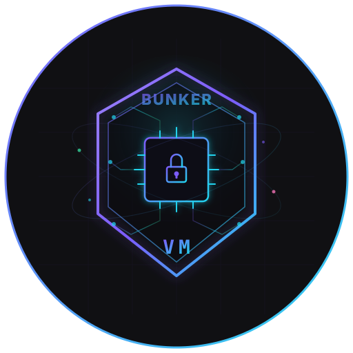

<p align="center">
  
</p>

<h1 align="center">BunkerVM</h1>

<p align="center">
  <strong>Time-travel debugging for AI agent sandboxes.</strong><br>
  Hardware-isolated Firecracker microVMs with snapshot, replay, and diff — not containers.
</p>

<p align="center">
  <a href="https://pypi.org/project/bunkervm/"></a>
  <a href="https://github.com/ashishgituser/bunkervm/actions/workflows/ci.yml"></a>
  <a href="https://github.com/ashishgituser/bunkervm"></a>
  
  
  <a href="https://github.com/ashishgituser/bunkervm/blob/main/LICENSE"></a>
</p>

---

## The problem

AI agents execute code on your machine. When something goes wrong — and it will — you have no way to see **what the agent actually did**, rewind to the moment **before** it broke, or compare **why one agent succeeded and another failed**.

Containers share your kernel ([escapes are real](https://cve.mitre.org/cgi-bin/cvekey.cgi?keyword=docker+escape)).  
Cloud sandboxes send your data to someone else's server.  
Neither gives you observability into agent behaviour.

**BunkerVM** solves all three: isolation, observability, and time-travel.

---

## What it does

Each sandbox is a [Firecracker](https://firecracker-microvm.github.io/) microVM — the same technology behind AWS Lambda. Own kernel, own filesystem, hardware-level (KVM) isolation. Not a container.

On top of that, BunkerVM adds capabilities that no other sandbox provides:

### Record every execution

```python
from bunkervm import Sandbox

with Sandbox(record=True) as sb:
    sb.run("import pandas as pd")
    sb.run("df = pd.read_csv('/data/input.csv')")
    sb.run("df['total'] = df.price * df.qty")
    sb.run("df.to_csv('/output/result.csv')")

# Every step recorded: command, output, filesystem changes, VM snapshot
```

### Rewind to any point

```python
sb.restore(step=2)  # VM state rewinds to after read_csv
sb.run("df.describe()")  # explore from that exact point
```

The VM's memory, CPU registers, filesystem — everything reverts to exactly what it was after step 2. Not a re-run. An actual restore from a Firecracker snapshot.

### See what changed

```python
for cp in sb.history():
    print(f"step {cp['step']}: {cp['command']}")
    if cp['trace']:
        for f in cp['trace']['files_created']:
            print(f"  + {f['path']} ({f['size']} bytes)")
```

```
step 1: import pandas as pd
step 2: df = pd.read_csv('/data/input.csv')
  ~ /data/input.csv (read)
step 3: df['total'] = df.price * df.qty
step 4: df.to_csv('/output/result.csv')
  + /output/result.csv (1247 bytes)
```

### Compare two agents

```bash
bunkervm diff session-abc session-def
```

```
Agent Diff
  Session A: abc  (12 steps, 3400ms)
  Session B: def  (8 steps, 1200ms)

  Files only in A:  /tmp/debug.log, /tmp/retry_3.py
  Files only in B:  /output/result.csv

  step  1  [same]  import pandas as pd
  step  2  [same]  df = pd.read_csv('/data/input.csv')
  step  3  [diff]
    A: df = df.dropna()
    B: df = df.fillna(0)
  step  4  [diff]
    A: # crashed — KeyError: 'total'
    B: df['total'] = df.price * df.qty  ← OK
```

Agent A dropped rows and lost a required column. Agent B filled missing values and succeeded. Without diff, you'd never know why.

---

## Quick start

```bash
pip install bunkervm
```

```python
from bunkervm import run_code

result = run_code("print('Hello from a microVM!')")
print(result)  # Hello from a microVM!
```

VM boots, code runs, VM dies. Your host was never touched.

---

## How it works

```
AI Agent
   │
   ▼
bunkervm (host)  ──vsock──▶  Firecracker MicroVM
   │                          ┌────────────────────┐
   │  record=True             │  Alpine Linux       │
   │  ─────────▶              │  Own kernel         │
   │  snapshot()              │  exec_agent.py      │
   │  trace()                 │  (filesystem trace) │
   │  restore()               └────────────────────┘
   │                          KVM hardware isolation
   ▼
~/.bunkervm/sessions/         ~/.bunkervm/snapshots/
  session-abc.json              step1/ vmstate + memory
  session-def.json              step2/ vmstate + memory
```

**Firecracker** provides the isolation. BunkerVM adds the instrumentation layer:

| Layer | What it does |
|---|---|
| **exec_agent** (inside VM) | Traces filesystem changes per command — files created, modified, deleted, bytes written |
| **Firecracker API** (host→VM) | Pauses VM, snapshots CPU + memory state to disk, resumes — all via Firecracker's built-in snapshot API |
| **Snapshot manager** (host) | Stores and indexes snapshots at `~/.bunkervm/snapshots/`, manages lifecycle |
| **Session recorder** (host) | Chains commands → traces → snapshots into a replayable session JSON |

No custom kernel modules. No eBPF. No ptrace. The VM is the isolation boundary; the API socket is the control plane. Pure Python, stdlib-only transport.

---

## The four capabilities

### 1. Filesystem tracing

Every command execution can return a trace of what changed on disk.

```python
result = client.exec("python3 train.py", trace=True)
print(result["trace"])
# {
#   "files_created": [{"path": "/output/model.pkl", "size": 4820}],
#   "files_modified": [{"path": "/tmp/loss.log", "old_size": 0, "new_size": 312}],
#   "files_deleted": [],
#   "bytes_written": 5132
# }
```

This happens inside the VM — a pre/post filesystem snapshot diff. No host-side hooks, no strace, no overhead on non-traced commands.

### 2. VM snapshots

Full VM state (CPU, memory, filesystem) saved to disk. Restore boots a new Firecracker process from that state instead of cold-booting.

```python
from bunkervm import Sandbox

with Sandbox() as sb:
    sb.run("import torch; model = torch.load('bert.pt')")
    sb.checkpoint("model-loaded")       # snapshot: 45ms
    sb.run("output = model(bad_input)") # crashes
    sb.restore(step=1)                  # restore: <100ms
    sb.run("output = model(good_input)")# works
```

Snapshot = Firecracker's native `PUT /snapshot/create`. Not a filesystem copy. The memory file is sparse and CoW-friendly.

### 3. Session recording & replay

`record=True` automatically chains traces and snapshots into a session timeline.

```python
# test_replay.py
from bunkervm import Sandbox

with Sandbox(record=True) as sb:
    sb.run("x = 42")
    print("Result:", sb.run("print(x * 2)"))

    # Create directory first, then write file
    sb.run("import os; os.makedirs('/tmp/output', exist_ok=True)")
    sb.run("open('/tmp/output/result.txt', 'w').write(str(x))")
    print("File content:", sb.run("print(open('/tmp/output/result.txt').read())"))

    print("\nHistory:")
    for step in sb.history():
        print(f"  Step {step['step']}: {step['command'][:60]}")
```

```
$ python test_replay.py
Starting sandbox via BunkerVM engine...
Sandbox ready (via engine).
Result: 84
File content: 42

History:
  Step 1: x = 42
  Step 2: print(x * 2)
  Step 3: import os; os.makedirs('/tmp/output', exist_ok=True)
  Step 4: open('/tmp/output/result.txt', 'w').write(str(x))
  Step 5: print(open('/tmp/output/result.txt').read())
Session saved to ~/.bunkervm/sessions/d0c13cb74d85.json
Destroying sandbox...
Done.
```

```bash
bunkervm replay d0c13cb74d85 --trace
```

```
Session: d0c13cb74d85
  Steps: 5
  Recorded: 2026-03-29 23:15

Timeline:

     step   1  [ok]      34ms  x = 42
     step   2  [ok]      23ms  print(x * 2)
     step   3  [ok]      22ms  import os; os.makedirs('/tmp/output', exist_ok=True)
     step   4  [ok]      21ms  open('/tmp/output/result.txt', 'w').write(str(x))
     step   5  [ok]      21ms  print(open('/tmp/output/result.txt').read())
```

Each 📸 = a restorable VM snapshot. You can `restore(step=2)` and branch from there.

### 4. Agent diff

Run the same task with two different agents (or prompts, or models). Record both. Diff.

```bash
bunkervm diff session-gpt4 session-claude --format json
```

The diff shows: which files each agent created, which steps diverged, which agent was faster, and where failures happened. This is how you debug agent quality — not by reading logs, but by comparing filesystem-level behaviour.

---

## Why not E2B / Daytona / Modal?

Those are hosted sandbox platforms — good at giving your agent a place to run. BunkerVM is a local, self-hosted debugger for whatever sandbox your agent already runs in. As of writing, none of the major hosted sandboxes ship automatic action recording, mid-session VM snapshot/restore, and cross-run diffing together:

| | BunkerVM | E2B / Daytona / Modal |
|---|---|---|
| Isolation | Firecracker microVM (hardware/KVM) | Firecracker or container, depending on provider |
| Hosting | Local, self-hosted — nothing leaves your machine | Cloud-hosted |
| Auto-records every command | ✅ | ❌ (manual snapshot primitives at best) |
| Mid-session restore | ✅ full VM state (memory + fs) | Fork-from-snapshot, not automatic rewind |
| Diff two agent runs | ✅ `bunkervm diff` | ❌ |
| Cost | Free, open source | Usage-billed |

Trade-off: you run it on your own machine (needs `/dev/kvm` or WSL2), and it won't scale to thousands of concurrent sandboxes the way a hosted platform will. If you need managed multi-tenant infra, use one of those. If you need to see exactly what your agent did and rewind to before it broke, that's what this is for.

---

## Integrations

### MCP (Claude Desktop, VS Code Copilot, any MCP client)

```bash
bunkervm vscode-setup     # generates .vscode/mcp.json, works on Windows WSL2
bunkervm server            # stdio for Claude Desktop
bunkervm server --transport sse  # SSE for web
```

8 MCP tools: `sandbox_exec`, `sandbox_write_file`, `sandbox_read_file`, `sandbox_list_dir`, `sandbox_upload_file`, `sandbox_download_file`, `sandbox_status`, `sandbox_reset`.

### Any agent framework

`secure_agent()` wraps a single-tool adapter around whatever you already have, no BunkerVM-specific toolkit required:

```python
from bunkervm import secure_agent

runtime = secure_agent()
tool = runtime.as_tool()          # LangChain-compatible tool (requires langchain-core)
tool = runtime.as_openai_tool()   # OpenAI Agents SDK tool (requires openai-agents)
```

---

## Install

```bash
pip install bunkervm
```

**Requirements:** Linux with `/dev/kvm`, or Windows WSL2 ([enable nested virtualization](https://learn.microsoft.com/en-us/windows/wsl/wsl-config#main-wsl-settings)). Python 3.10+.

The Firecracker binary + kernel + rootfs (~100MB) auto-download on first run. Or download from [Releases](https://github.com/ashishgituser/bunkervm/releases).

<details>
<summary><strong>WSL2 setup (Windows)</strong></summary>

Add to `%USERPROFILE%\.wslconfig`:
```ini
[wsl2]
nestedVirtualization=true
```
Then: `wsl --shutdown`

</details>

<details>
<summary><strong>Troubleshooting</strong></summary>

| Problem | Fix |
|---|---|
| `/dev/kvm` not found | `sudo modprobe kvm` or enable nested virtualization |
| Permission denied | `sudo usermod -aG kvm $USER` then re-login |
| Bundle download fails | Manual download from [Releases](https://github.com/ashishgituser/bunkervm/releases) → `~/.bunkervm/bundle/` |
| VM won't start | `bunkervm info` — diagnoses all prerequisites |

</details>

<details>
<summary><strong>Build from source</strong></summary>

```bash
git clone https://github.com/ashishgituser/bunkervm.git
cd bunkervm
sudo bash build/setup-firecracker.sh
sudo bash build/build-sandbox-rootfs.sh
pip install -e ".[dev]"
pytest tests/
```

</details>

---

## CLI

```
bunkervm demo                              # see it in action
bunkervm run script.py                     # run a script in a sandbox
bunkervm run -c "print(42)"               # inline code
bunkervm replay <session-id> --trace       # replay recorded session
bunkervm diff <session-a> <session-b>      # compare two agent runs
bunkervm snapshot list                     # list VM snapshots
bunkervm snapshot delete <name>            # delete a snapshot
bunkervm server --transport sse            # MCP server
bunkervm info                              # system readiness check
```

---

## Contributing

See [CONTRIBUTING.md](CONTRIBUTING.md).

## Security

See [SECURITY.md](SECURITY.md).

## License

MIT

---

<p align="center">
  <strong>If BunkerVM helps you build safer agents, <a href="https://github.com/ashishgituser/bunkervm">star the repo</a></strong>
</p>
