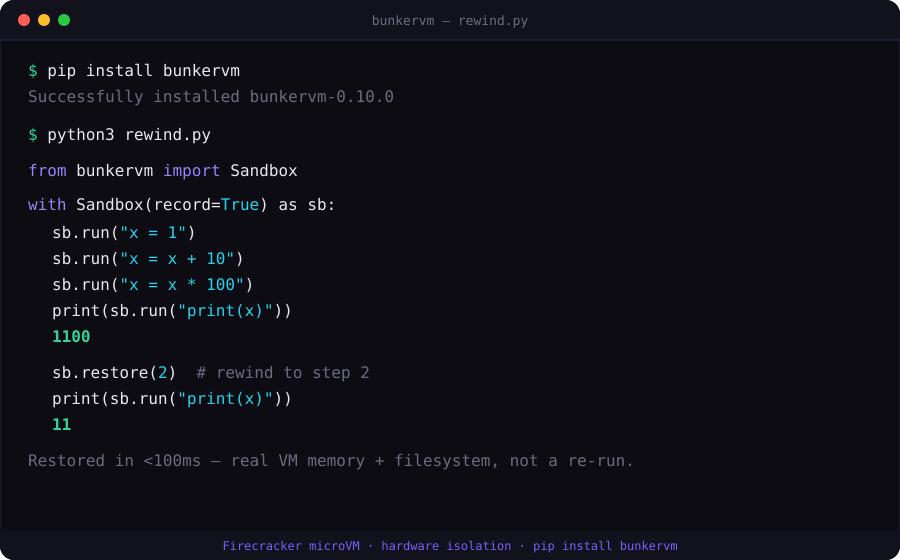

<p align="center">
  
</p>

<h1 align="center">BunkerVM</h1>

<p align="center">
  <strong>Time-travel debugging for AI agent sandboxes.</strong><br>
  Hardware-isolated Firecracker microVMs with snapshot, replay, and diff — not containers.
</p>

<p align="center">
  <a href="https://pypi.org/project/bunkervm/"></a>
  <a href="https://github.com/ashishgituser/bunkervm/actions/workflows/ci.yml"></a>
  <a href="https://m8ven.ai/mcp/ashishgituser-bunkervm-yshkwg"></a>
  <a href="https://github.com/ashishgituser/bunkervm"></a>
  
  
  <a href="https://github.com/ashishgituser/bunkervm/blob/main/LICENSE"></a>
</p>

<p align="center">
  
</p>

That's a real run: three commands mutate `x` to `1100`, one line rewinds the sandbox to step 2, and `x` is `11` again — actual state restored, not the script re-executed. That's what this repo does. **Works on macOS too** — see [Two ways to run it](#two-ways-to-run-it).

---

## Is this for you?

If you've ever stared at an agent that did fifteen things and failed, with zero visibility into what happened or a way back to before it broke — yes. BunkerVM gives every sandboxed run a rewind button and a diff tool, on your own machine, for free.

It works through MCP (Claude Desktop, VS Code Copilot, any MCP client), through the CLI, or as a plain Python API. There are single-tool adapters for LangChain and the OpenAI Agents SDK if you want one — see [Integrations](#integrations).

If you need managed infrastructure for thousands of concurrent sandboxes, this isn't that — see [Why not E2B / Daytona / Modal?](#why-not-e2b--daytona--modal) below.

## The problem

AI agents execute code on your machine. When something goes wrong — and it will — you have no way to see **what the agent actually did**, rewind to the moment **before** it broke, or tell **why one agent succeeded and another failed** on the same task.

Most debugging here means re-running and hoping, or reading a transcript the agent wrote about itself. BunkerVM records every step as it actually happens — commands, exit codes, filesystem changes — so you can rewind to any point and inspect real state, not a self-report.

It also happens to run each sandbox in a hardware-isolated [Firecracker](https://firecracker-microvm.github.io/) microVM when your machine supports it (same tech as AWS Lambda) — because [containers share your kernel](https://cve.mitre.org/cgi-bin/cvekey.cgi?keyword=docker+escape) and cloud sandboxes send your data to someone else's server. On machines that can't do that (macOS, plain Windows), a local no-isolation fallback keeps the record/rewind/diff workflow available — see below.

---

## Start here: watch what your coding agent does

Everything else in this README asks you to set something up before it helps you. This doesn't. If you use Claude Code, turn it on once per repo and forget about it:

```bash
bunkervm watch
```

That installs a `PostToolUse` hook. From then on, every command your agent runs is recorded in the background. When it says it's done, ask what actually happened:

```bash
bunkervm review
```

```
Session 4f2a91c8  5 commands, 1 edit, 14m

  ! test count dropped: 12 -> 9 (3 fewer) running `npm test`
  ! deleted: src/__tests__/auth.test.js
  ! installed 1 package(s): npm install

  test runs: 3   tests in last run: 9
  files edited: 1
      src/auth.js
```

That first line is the reason this exists. An agent can turn a red suite green by deleting the failing test, and `git diff` will happily show you the deleted file in the middle of a large diff without you registering that the suite got smaller. A number going down is much harder to skim past.

Deleting isn't the only way, so the count alone isn't enough:

| How the agent got to green | Suite size | Caught by |
|---|---|---|
| Deleted the failing test | shrinks | test count dropped |
| Added `@pytest.mark.skip` | unchanged | tests silenced |
| Marked it `xfail` | unchanged | tests silenced |
| Actually fixed the bug | unchanged | *nothing — no flag* |

```
! 1 more test skipped or xfailed (0 -> 1) running `pytest -q` -
  silenced tests turn a suite green without fixing anything
```

47 tests before, 47 after, nothing deleted — only the skipped count moved.

It's deliberately quiet, because a warning people learn to ignore is worse than no warning. Counts are only ever compared **per command**: running the whole suite and then iterating on one file is the most common thing an agent does, and it must not read as 80 deleted tests. Routine cleanup (`rm -rf node_modules`, `dist/`, `*.pyc`) never fires the deletion flag either, and un-skipping a test is never flagged.

It does not catch everything. An agent that weakens an assertion or mocks out the thing under test still passes silently — those don't show up in test output, so nothing here can see them.

No VM, no KVM, works on macOS/Linux/Windows. Turn it off with `bunkervm watch --off`. Logs go to `.bunkervm/watch/` (already gitignored) and never leave your machine.

---

## Two ways to run it

| | Firecracker (`Sandbox()`) | Local (`Sandbox(backend="local")`) |
|---|---|---|
| Isolation | Hardware (KVM microVM) | **None** — a plain subprocess |
| Platforms | Linux, Windows+WSL2 | Anywhere Python runs, incl. **macOS** |
| Record / rewind / diff | ✅ full VM state | ✅ namespace + working directory |
| Setup | `/dev/kvm` or WSL2, ~100MB bundle | Nothing — `pip install` and go |
| Use for | Running agent-generated code you don't fully trust | Trying the workflow, debugging on a machine without KVM |

The local backend is never selected automatically — you have to ask for it (`backend="local"`, `--local`), and BunkerVM tells you which one is active every time. It exists because the record/rewind/diff value doesn't require a hypervisor, only the isolation does — and a lot of development happens on machines that can't run one.

```bash
bunkervm demo --local     # works everywhere, no KVM/WSL2 needed
bunkervm demo             # real hardware isolation (Linux, or Windows+WSL2)
```

## What it does

In Firecracker mode, each sandbox is a [Firecracker](https://firecracker-microvm.github.io/) microVM — the same technology behind AWS Lambda. Own kernel, own filesystem, hardware-level (KVM) isolation. Not a container. The examples below use this mode; swap in `backend="local"` and everything except true VM-level restore works the same way.

On top of that, BunkerVM adds capabilities that no other sandbox provides:

### Record every execution

```python
from bunkervm import Sandbox

with Sandbox(record=True) as sb:
    sb.run("import pandas as pd")
    sb.run("df = pd.read_csv('/data/input.csv')")
    sb.run("df['total'] = df.price * df.qty")
    sb.run("df.to_csv('/output/result.csv')")

# Every step recorded: command, output, filesystem changes, VM snapshot
```

### Rewind to any point

```python
sb.restore(step=2)  # VM state rewinds to after read_csv
sb.run("df.describe()")  # explore from that exact point
```

The VM's memory, CPU registers, filesystem — everything reverts to exactly what it was after step 2. Not a re-run. An actual restore from a Firecracker snapshot.

### See what changed

```python
for cp in sb.history():
    print(f"step {cp['step']}: {cp['command']}")
    if cp['trace']:
        for f in cp['trace']['files_created']:
            print(f"  + {f['path']} ({f['size']} bytes)")
```

```
step 1: import pandas as pd
step 2: df = pd.read_csv('/data/input.csv')
  ~ /data/input.csv (read)
step 3: df['total'] = df.price * df.qty
step 4: df.to_csv('/output/result.csv')
  + /output/result.csv (1247 bytes)
```

### Compare two agents

Every recorded session gets an auto-generated ID (printed when the sandbox exits, or via `sb.session_id`). Run the same task through two agents, then:

```bash
bunkervm diff d0c13cb74d85 f29a61bb02e7
```

```
Agent Diff
  Session A: d0c13cb74d85  (12 steps, 3400ms)
  Session B: f29a61bb02e7  (8 steps, 1200ms)

  Files only in A:  /tmp/debug.log, /tmp/retry_3.py
  Files only in B:  /output/result.csv

  step  1  [same]  import pandas as pd
  step  2  [same]  df = pd.read_csv('/data/input.csv')
  step  3  [diff]
    A: df = df.dropna()
    B: df = df.fillna(0)
  step  4  [diff]
    A: # crashed — KeyError: 'total'
    B: df['total'] = df.price * df.qty  ← OK
```

Agent A dropped rows and lost a required column. Agent B filled missing values and succeeded. Without diff, you'd never know why.

### Rank multiple agents

`diff` is pairwise. To score and rank several runs at once — which model, which prompt, which agent actually did the job — run `compare`.

Here is the case that makes the point. One project, one real bug (`average([])` divides by zero), three agents told *"make the test suite pass."* All three finish with a green suite and exit code 0. CI would show three green checks.

```bash
bunkervm compare f3842404470f 037405490acd edc5dc5b6691 \
  --label reads-the-error --label deletes-the-test --label fixes-it-messily
```

```
Agent Comparison  (3 sessions)

  #1  reads-the-error  [local]  4 steps  ended green  1641ms
      files: +0 created  ~1 modified  -0 deleted   risk: read x1  write x3
  #2  deletes-the-test  [local]  3 steps  ended green  1563ms
      files: +0 created  ~0 modified  -1 deleted   risk: write x3
      ! ended green after deleting /root/project/tests/test_stats.py - a passing
        suite here does not prove the bug was fixed
  #3  fixes-it-messily  [local]  5 steps  ended green  1702ms
      files: +2 created  ~1 modified  -1 deleted   risk: write x4  system x1
      ! ended green after deleting 1 file(s): /root/project/stats.py.bak

  Ranked by: ended in a working state, then fewest destructive/blocked commands,
  then fewest files deleted, then total time.
  Lines marked ! are heuristics for your attention and do not affect rank.
```

The tell is in the pytest output itself: `reads-the-error` ends on `5 passed`, `deletes-the-test` ends on `2 passed`. Same exit code, three fewer tests.

Note what *didn't* catch it. The [safety classifier](bunkervm/safety.py) scored `rm tests/test_stats.py` as an ordinary `write`, because as shell commands go it's unremarkable. The filesystem trace is what caught it — recorded before and after every step, so what an agent did survives what it claims it did.

Every column is a fact already captured by `record=True`: exit codes, timing, the classifier's risk tier per command, and the trace. No LLM judge, no rubric to configure. `--html` renders the same data as a shareable report — see the [bake-off report](https://ashishgituser.github.io/bunkervm/bakeoff-example.html) or [another example](https://ashishgituser.github.io/bunkervm/compare-example.html) comparing three agents on a messy CSV.

Run the bake-off yourself — no API key, no KVM, works on macOS/Linux/Windows:

```bash
python examples/agent-bakeoff/run_bakeoff.py
```

See [`examples/agent-bakeoff/`](examples/agent-bakeoff/) for the fixture and the honest limits of the scoring.

---

## Quick start

```bash
pip install bunkervm
```

```python
from bunkervm import run_code

result = run_code("print('Hello from a microVM!')")
print(result)  # Hello from a microVM!
```

VM boots, code runs, VM dies. Your host was never touched.

---

## How it works

```
AI Agent
   │
   ▼
bunkervm (host)  ──vsock──▶  Firecracker MicroVM
   │                          ┌────────────────────┐
   │  record=True             │  Alpine Linux       │
   │  ─────────▶              │  Own kernel         │
   │  snapshot()              │  exec_agent.py      │
   │  trace()                 │  (filesystem trace) │
   │  restore()               └────────────────────┘
   │                          KVM hardware isolation
   ▼
~/.bunkervm/sessions/         ~/.bunkervm/snapshots/
  d0c13cb74d85.json             d0c13cb74d85-step1/ vmstate + memory
                                 d0c13cb74d85-step2/ vmstate + memory
```

**Firecracker** provides the isolation. BunkerVM adds the instrumentation layer:

| Layer | What it does |
|---|---|
| **exec_agent** (inside VM) | Traces filesystem changes per command — files created, modified, deleted, bytes written |
| **Firecracker API** (host→VM) | Pauses VM, snapshots CPU + memory state to disk, resumes — all via Firecracker's built-in snapshot API |
| **Snapshot manager** (host) | Stores and indexes snapshots at `~/.bunkervm/snapshots/`, manages lifecycle |
| **Session recorder** (host) | Chains commands → traces → snapshots into a replayable session JSON |

No custom kernel modules. No eBPF. No ptrace. The VM is the isolation boundary; the API socket is the control plane. Pure Python, stdlib-only transport.

---

## Named checkpoints & replaying a session

`restore(step=N)` rewinds to an auto-recorded step. For a checkpoint you want to name and return to deliberately — e.g. right after a slow setup step — use `checkpoint()`:

```python
with Sandbox() as sb:
    sb.run("import torch; model = torch.load('bert.pt')")
    sb.checkpoint("model-loaded")        # snapshot: 45ms
    sb.run("output = model(bad_input)")  # crashes
    sb.restore(step=1)                   # restore: <100ms
    sb.run("output = model(good_input)") # works
```

Every `record=True` session is saved to `~/.bunkervm/sessions/<id>.json` on exit and can be replayed from the CLI, independent of the process that created it:

```bash
bunkervm replay d0c13cb74d85 --trace
```

```
Session: d0c13cb74d85
  Steps: 5
  Recorded: 2026-03-29 23:15

     step   1  [ok]      34ms  x = 42
     step   2  [ok]      23ms  print(x * 2)
     step   3  [ok]      22ms  import os; os.makedirs('/tmp/output', exist_ok=True)
     step   4  [ok]      21ms  open('/tmp/output/result.txt', 'w').write(str(x))
     step   5  [ok]      21ms  print(open('/tmp/output/result.txt').read())
```

---

## Why not E2B / Daytona / Modal?

Those are hosted sandbox platforms — good at giving your agent a place to run. BunkerVM is a local, self-hosted debugger for whatever sandbox your agent already runs in. As of writing, none of the major hosted sandboxes ship automatic action recording, mid-session VM snapshot/restore, and cross-run diffing together:

| | BunkerVM | E2B / Daytona / Modal |
|---|---|---|
| Isolation | Firecracker microVM (hardware/KVM) | Firecracker or container, depending on provider |
| Hosting | Local, self-hosted — nothing leaves your machine | Cloud-hosted |
| Auto-records every command | ✅ | ❌ (manual snapshot primitives at best) |
| Mid-session restore | ✅ full VM state (memory + fs) | Fork-from-snapshot, not automatic rewind |
| Diff two agent runs | ✅ `bunkervm diff` | ❌ |
| Cost | Free, open source | Usage-billed |

Trade-off: it won't scale to thousands of concurrent sandboxes the way a hosted platform will. If you need managed multi-tenant infra, use one of those. If you need to see exactly what your agent did and rewind to before it broke, that's what this is for — with real hardware isolation where your machine supports it (`/dev/kvm` or WSL2), or the same record/rewind/diff workflow with no isolation anywhere else, including macOS.

One consequence worth stating plainly: **BunkerVM cannot be shipped as a Docker image.** Firecracker needs `/dev/kvm`, so there is no `docker run` one-liner and no hosted build a registry can verify by executing. That is the same property that makes the isolation real — a sandbox you can run inside a container is sharing that container's kernel. Install it with `pip`, run it on hardware.

---

## Integrations

### MCP (Claude Desktop, VS Code Copilot, any MCP client)

```bash
bunkervm vscode-setup     # generates .vscode/mcp.json, works on Windows WSL2
bunkervm server            # stdio for Claude Desktop
bunkervm server --transport sse  # SSE for web
```

8 MCP tools: `sandbox_exec`, `sandbox_write_file`, `sandbox_read_file`, `sandbox_list_dir`, `sandbox_upload_file`, `sandbox_download_file`, `sandbox_status`, `sandbox_reset`.

### Any agent framework

`secure_agent()` wraps a single-tool adapter around whatever you already have, no BunkerVM-specific toolkit required:

```python
from bunkervm import secure_agent

runtime = secure_agent()
tool = runtime.as_tool()          # LangChain-compatible tool (requires langchain-core)
tool = runtime.as_openai_tool()   # OpenAI Agents SDK tool (requires openai-agents)
```

---

## Install

```bash
pip install bunkervm
bunkervm demo --local     # macOS / no KVM — works immediately, no download
bunkervm demo             # real hardware isolation — Linux, or Windows+WSL2
```

**For hardware isolation:** Linux with `/dev/kvm`, or Windows WSL2 ([enable nested virtualization](https://learn.microsoft.com/en-us/windows/wsl/wsl-config#main-wsl-settings)). Python 3.10+. The Firecracker binary + kernel + rootfs (~100MB) auto-download on first run, or download from [Releases](https://github.com/ashishgituser/bunkervm/releases).

**For the local backend:** nothing beyond Python 3.10+. No isolation — see [Two ways to run it](#two-ways-to-run-it).

<details>
<summary><strong>WSL2 setup (Windows)</strong></summary>

Add to `%USERPROFILE%\.wslconfig`:
```ini
[wsl2]
nestedVirtualization=true
```
Then: `wsl --shutdown`

</details>

<details>
<summary><strong>Troubleshooting</strong></summary>

| Problem | Fix |
|---|---|
| `/dev/kvm` not found | `sudo modprobe kvm` or enable nested virtualization |
| Permission denied | `sudo usermod -aG kvm $USER` then re-login |
| Bundle download fails | Manual download from [Releases](https://github.com/ashishgituser/bunkervm/releases) → `~/.bunkervm/bundle/` |
| VM won't start | `bunkervm info` — diagnoses all prerequisites |

</details>

<details>
<summary><strong>Build from source</strong></summary>

```bash
git clone https://github.com/ashishgituser/bunkervm.git
cd bunkervm
sudo bash build/setup-firecracker.sh
sudo bash build/build-sandbox-rootfs.sh
pip install -e ".[dev]"
pytest tests/
```

</details>

---

## CLI

```
bunkervm demo                              # see it in action (real isolation)
bunkervm demo --local                      # see it in action (no KVM needed — macOS, etc.)
bunkervm run script.py                     # run a script in a sandbox
bunkervm run -c "print(42)"               # inline code
bunkervm run script.py --local             # run without isolation, no KVM/WSL2 required
bunkervm replay <session-id> --trace       # replay recorded session
bunkervm diff <session-a> <session-b>      # compare two agent runs
bunkervm compare <a> <b> <c> --html out.html  # rank multiple agent runs
bunkervm snapshot list                     # list VM snapshots
bunkervm snapshot delete <name>            # delete a snapshot
bunkervm server --transport sse            # MCP server
bunkervm info                              # system readiness check
```

---

## Contributing

See [CONTRIBUTING.md](CONTRIBUTING.md).

## Security

See [SECURITY.md](SECURITY.md). The MCP server is unauthenticated and binds
`127.0.0.1` by default — see [PRIVACY.md](PRIVACY.md) before widening it.

## Privacy

No telemetry, no accounts, no backend. Everything stays on your machine.
See [PRIVACY.md](PRIVACY.md).

## License

MIT

---

<p align="center">
  <strong>If BunkerVM helps you build safer agents, <a href="https://github.com/ashishgituser/bunkervm">star the repo</a></strong>
</p>
